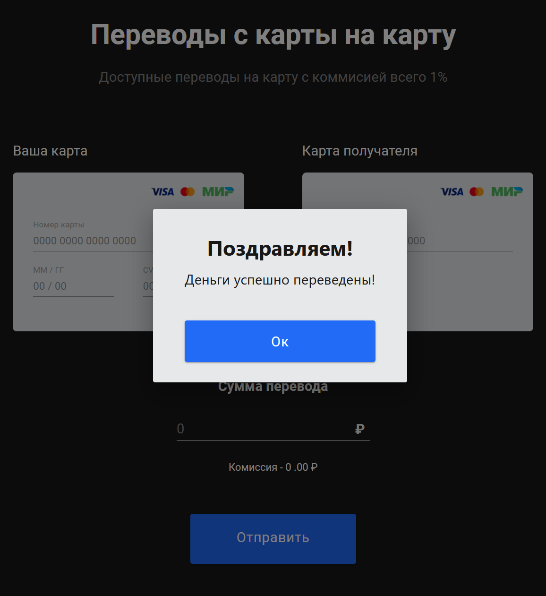
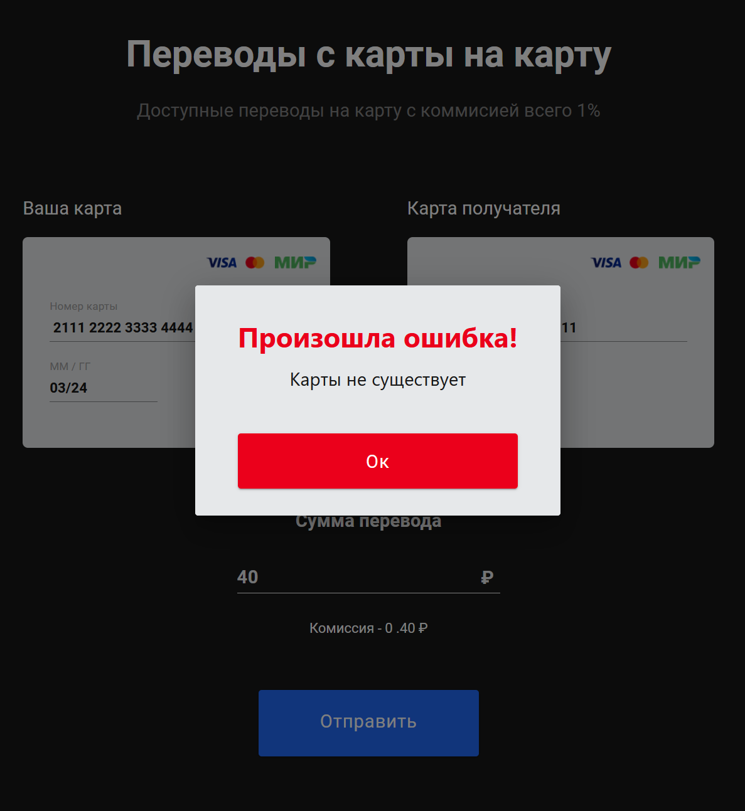
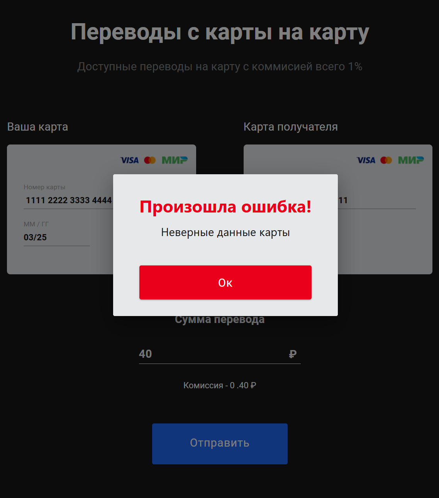
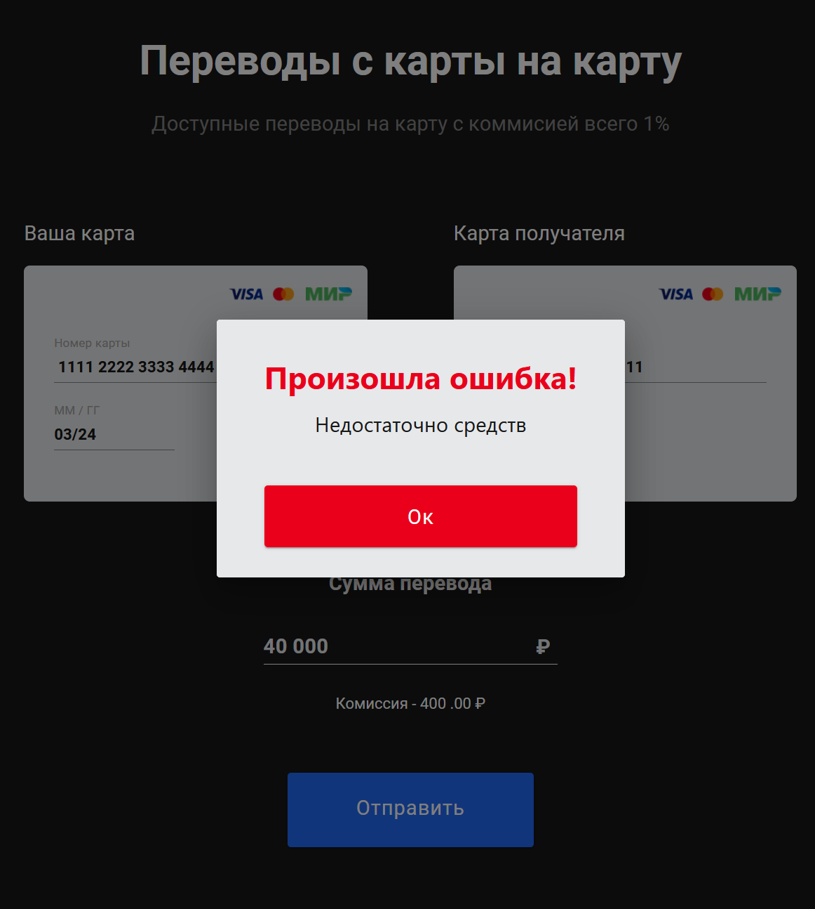

# Money Transfer Project

Проект Money Transfer представляет собой приложение для перевода денег с одной карты на другую. В этом файле описаны возможные исходы работы программы и формат записи транзакций и ошибок.

## Исходы работы программы

1. **Удачный перевод денег с карты на карту**

   В этом случае обе карты существуют в файле `cards.json`, ствуют в файле `cards.json`, все дан все данные карты введены корректно и код подтверждения от фронта пришёл со значением, отличным от `null`.

   
2. **Карты не существует**

   Номер карты введен в корректной форме, но в файле `cards.json` такой карты нет. В этом случае приложение выбрасывает исключение `InputDataException` и отправляет на фронт `ResponseEntity<ExceptionResponse>` с `HttpStatus.BAD_REQUEST (400)` и сообщением "Карты не существует".

   
3. **Неверные данные карты**

   Номер карты введен в корректной форме, карта есть в файле `cards.json`, но какие-то данные этой карты (CVV и/или дата истечения срока действия) были введены неверно. В этом случае приложение выбрасывает исключение `InputDataException` и отправляет на фронт `ResponseEntity<ExceptionResponse>` с `HttpStatus.BAD_REQUEST (400)` и сообщением "Неверные данные карты".

   
4. **Недостаточно средств**

   Номер карты введен в корректной форме, карта есть в файле `cards.json`, данные этой карты (CVV и/или дата истечения срока действия) были введены верно, но на карте списания оказалось меньше средств, чем запрашивается для перевода. В этом случае приложение выбрасывает исключение `InputDataException` и отправляет на фронт `ResponseEntity<ExceptionResponse>` с `HttpStatus.BAD_REQUEST (400)` и сообщением "Недостаточно средств".

   
5. **Нет кода подтверждения**

   Номер карты введен в корректной форме, карта есть в файле `cards.json`, данные этой карты (CVV и/или дата истечения срока действия) были введены верно и на карте списания оказалось достаточно средств для перевода, но код подтверждения для перевода не был отправлен (пришёл со значением `null`). В этом случае приложение выбрасывает исключение `ConfirmationException` и отправляет на фронт `ResponseEntity<ExceptionResponse>` с `HttpStatus.INTERNAL_SERVER_ERROR (500)` и сообщением "Неверный код".

## Формат записи транзакций и ошибок

В каждом случае транзакция записывается в файл `transfer.log` в следующем формате:

*"19-06-2023 14:02:05.955 - ID операции: 2, Номер карты списания: 1111222233334444, Номер карты зачисления: 8888999900001111, Сумма: 4.00 RUR, Комиссия: 0.04 RUR, Результат операции: Проведена"*

Если происходит ошибка, то она записывается в файл `error.log` в следующем формате:

*"19-06-2023 19:45:31.700 - Неверный код (500 INTERNAL_SERVER_ERROR). Транзакция: 1"*

## Зависимости

Для запуска проекта требуется установленная Java версии 17 и Docker.

## Установка и запуск

1. **Склонируйте репозиторий:**
   ```git clone https://github.com/Karanbuksa/Money-transfer.git```
2. **Соберите проект, используя Maven:**
   ```mvn clean package```

   *(При упаковке приложения тесты могут не пройти из-за отсутсвия образа для Docker. В тестах используется Testconteiners. Можно воспользоваться командой ```mvn clean package -Dmaven.test.skip=true```)*
3. **Создайте Docker-образ:**
   ```docker-compose build```
4. Запустите контейнеры:
   ```docker-compose up```
5. После успешного запуска, приложение будет доступно по адресу:
   [http://localhost:5500](http://localhost:5500/)

## Дополнительные инструкции
Данные о переводах и ошибках (логи), а так же данные об аккаунтах карт записываются в файлы "log/transfer.log", "log/error.log" и "cards/cards.jsom" внутри контейнера.

Чтобы просматривать логи и изменения на аккаунтах соответствующих карт:

 1. Создайте в своей операционной системе папки "log" и "cards" для этих файлов и файл "cards.json" в папке "cards".
 2. В файле проекта "docker-compose.yml" раскомментируйте блок "volumes" и замените "- Disk:\path\to\your\directory" на путь к папкам  "log" и "cards".

При запуске приложения в папке "log" появятся файлы "transfer.log" и "error.log" и будут обновляться с каждым переводом (или попыткой), а в файл "cards.json" запишутся все заранее созданные карты и баланс на них будет обновляться с каждым успешным переводом.

 
